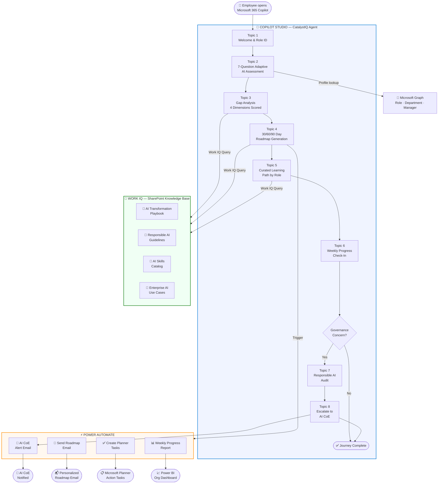

# CatalystIQ — Enterprise AI Transformation Copilot

> **Microsoft Agents League Hackathon 2026 | Enterprise Agents Track**  
> Powered by Copilot Studio · Work IQ · Microsoft 365 Copilot

---

## The Problem

**70% of enterprise AI initiatives fail** — not because of bad technology, but because organizations lack:
- A structured way to assess their AI readiness
- Personalized upskilling paths for each employee's role
- Ongoing change management and progress tracking
- Embedded responsible AI governance from day one

HR teams spend **200+ hours per initiative** manually assessing teams, curating training plans, and chasing completion. Executives get no real-time visibility. Employees get one-size-fits-all PDFs they never read.

---

## The Solution

**CatalystIQ** is an intelligent Microsoft 365 Copilot agent built in Copilot Studio that guides any employee — from frontline staff to C-suite — through their personal AI transformation journey.

It conducts a smart assessment, identifies gaps, generates a personalized 30/60/90 day roadmap, recommends curated learning resources from your company's SharePoint, creates tasks in Microsoft Planner, and checks in on progress weekly — all through a natural conversation in Microsoft 365 Copilot.

```
Employee opens M365 Copilot → Starts CatalystIQ → Answers 7 adaptive questions
→ Agent analyzes AI maturity across 4 dimensions → Queries Work IQ knowledge base
→ Generates personalized roadmap → Creates Planner tasks → Sends email summary
→ Checks progress weekly → Escalates governance concerns to AI Center of Excellence
```

---

## Architecture



---

## Key Features

### 1. Adaptive AI Readiness Assessment
Seven smart questions that adapt based on previous answers. The agent assesses AI maturity across **4 dimensions**:
- **Technology** — Infrastructure, tools, data quality
- **People** — Skills, mindset, change readiness
- **Process** — Workflows, automation opportunities
- **Governance** — Policies, ethics, compliance

### 2. Intelligent Gap Analysis with Work IQ
CatalystIQ queries your organization's SharePoint knowledge base via **Work IQ** to cross-reference the employee's scores against best-practice benchmarks, surfacing the 3 highest-impact gaps with specific evidence from company documents.

### 3. Personalized 30/60/90 Day Roadmap
Based on role, department, and maturity score, the agent generates a concrete, time-boxed roadmap — not generic advice, but specific actions tied to the employee's context. The roadmap is emailed and tasks are automatically created in Microsoft Planner.

### 4. Curated Learning Path
Work IQ retrieves relevant training resources from the company's SharePoint training catalog, filtering by role and skill level. Resources are ranked by ROI impact score.

### 5. Weekly Progress Check-in
A proactive conversational nudge each week that asks 3 quick questions, updates the employee's progress, adjusts the roadmap if needed, and generates a manager-ready progress report.

### 6. Responsible AI Audit Mode
A dedicated flow that walks teams through Microsoft's Responsible AI principles — Fairness, Reliability, Privacy, Inclusiveness, Transparency, Accountability — and generates a compliance checklist for any AI use case they're evaluating.

### 7. AI CoE Escalation
When governance questions exceed the agent's scope, it intelligently escalates to the organization's AI Center of Excellence with full conversation context, reducing the human triage burden.

---

## How It Meets the Judging Criteria

| Criterion | Weight | How CatalystIQ Delivers |
|---|---|---|
| Accuracy & Relevance | 20% | Purpose-built for enterprise AI transformation — the #1 challenge for every company in 2026. Integrates Work IQ, Copilot Studio, M365 Copilot, Power Automate, and Microsoft Graph. |
| Reasoning & Multi-step Thinking | 20% | 8-stage reasoning pipeline: role ID → adaptive assessment → dimensional scoring → knowledge retrieval → gap analysis → roadmap generation → task creation → progress tracking. Each step informs the next. |
| Reliability & Safety | 20% | Built-in Responsible AI topic, safe escalation paths, no PII stored in agent, graceful error handling on every branch, fallback messages on knowledge gaps. See [docs/reliability-and-safety.md](docs/reliability-and-safety.md) for full breakdown. |
| User Experience & Presentation | 15% | Conversational, natural flow. Progress indicators ("Step 3 of 7"). Clear, actionable outputs. Emailed summary. Planner tasks. Manager dashboard via Power Automate report. |
| Creativity & Originality | 15% | Meta-AI: an AI agent that guides AI adoption. First-of-its-kind enterprise AI readiness copilot built natively in M365 ecosystem. Adaptive assessment that changes questions based on role. |
| Community Vote | 10% | Universally relatable — every developer, manager, and HR team has lived this pain. |

---

## Microsoft IQ Integration — Work IQ

CatalystIQ uses **Work IQ** as its primary intelligence layer through Copilot Studio's knowledge sources:

1. **SharePoint Knowledge Base** — Connected via Work IQ to retrieve:
   - AI Transformation Playbook
   - Responsible AI Guidelines
   - AI Skills Training Catalog
   - Enterprise AI Use Cases by Industry

2. **Generative Answers** — Work IQ powers the gap analysis, generating grounded responses from company documents rather than hallucinated generic advice.

3. **Microsoft Graph Integration** — Pulls employee role, department, and manager context to personalize the assessment without asking the user to repeat information.

---

## Tech Stack

| Component | Technology |
|---|---|
| Agent Platform | Microsoft Copilot Studio |
| Intelligence Layer | Work IQ (SharePoint + Microsoft Graph) |
| Deployment | Microsoft 365 Copilot |
| Automation | Power Automate |
| Task Management | Microsoft Planner |
| Knowledge Store | SharePoint Online |
| Communication | Microsoft Teams + Outlook |

---

## Setup & Deployment

See [docs/setup-guide.md](docs/setup-guide.md) for complete step-by-step instructions.

**Quick Start:**
1. Clone this repo
2. Upload knowledge sources to SharePoint (see `knowledge-sources/`)
3. Import Copilot Studio agent (follow `docs/setup-guide.md`)
4. Connect Work IQ knowledge sources in Copilot Studio
5. Import Power Automate flows (see `power-automate/`)
6. Deploy M365 Copilot manifest (see `m365-copilot/manifest.json`)
7. Publish agent to Microsoft 365 Copilot
8. Test with the demo script (see `docs/demo-script.md`)

---

## Sustainability & Long-Term Impact

See [sustainability/impact-framework.md](sustainability/impact-framework.md) for the full framework.

**CatalystIQ is designed to get smarter over time:**
- Every interaction contributes to anonymized insights that improve the assessment model
- SharePoint knowledge base grows as the organization publishes new AI policies and learnings
- Power BI dashboard tracks adoption metrics, showing ROI to leadership
- The agent evolves from reactive (answering questions) to proactive (predicting readiness risks)

**Projected Impact (100-employee organization):**
- 80% reduction in manual assessment time (HR saves ~160 hours/initiative)
- 3x faster employee AI onboarding (weeks → days)
- 40% improvement in training completion rates (personalized vs generic)
- Measurable ROI dashboard for executive reporting

---

## Demo

📹 **[Watch the Demo Video](./demo/demo-video-placeholder.md)**

---

## License

MIT License — See [LICENSE](LICENSE)

---

## Team

Built for the **Microsoft Agents League Hackathon 2026** — Enterprise Agents Track  
By **Praveen Karthick** | Prodapt Solutions  
GitHub: [praveenkarthick108-arch](https://github.com/praveenkarthick108-arch)

---

*CatalystIQ — Because AI transformation starts with understanding where you are.*
